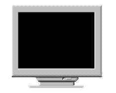



## A Slide Show Viewer

### Description

This program can be used for viewing thwe image files in both single and multiple mode and allows to view slide shows and in the external viewer and even allow to zoom in and zoom out the images.
 
### More Info
 
the user just has to select the image files for viewing.

nothing special just an little experiance of VB Programming

displays the picture as preview, full screen, slide show, and in external viewer enabling the zooming and zooming out of the images.

             |
---                |---
**Submitted On**   |2002-11-04 13:29:18
**By**             |[Harshvir Singh Sidhu](https://github.com/Planet-Source-Code/PSCIndex/blob/master/ByAuthor/harshvir-singh-sidhu.md)
**Level**          |Intermediate
**User Rating**    |4.8 (29 globes from 6 users)
**Compatibility**  |VB 6\.0
**Category**       |[Graphics](https://github.com/Planet-Source-Code/PSCIndex/blob/master/ByCategory/graphics__1-46.md)
**World**          |[Visual Basic](https://github.com/Planet-Source-Code/PSCIndex/blob/master/ByWorld/visual-basic.md)
**Archive File**   |[A\_Slide\_Sh170385242004\.zip](https://github.com/Planet-Source-Code/harshvir-singh-sidhu-a-slide-show-viewer__1-51483/archive/master.zip)

